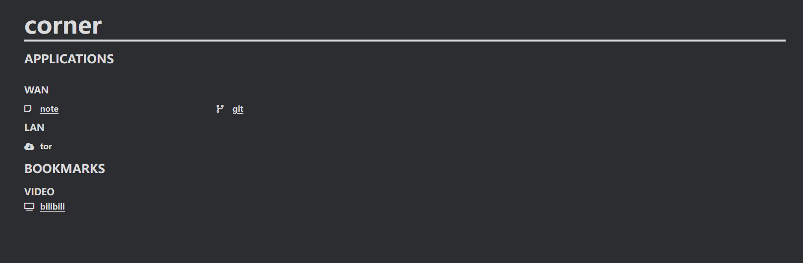

# corner

A minimalist start page written in Rust.



## Installation

* Make sure Rust is installed.

* Clone the git repository.

```git
git clone git@github.com:lrkkr/corner.git
```

## Build

```bash
cargo build --release
```

## Config

* Config `Router.toml`

Rename `Router-example.toml` to `Router.toml`.

```bash
mv ./Router-example.toml ./Router.toml
```

Add links and names according to [toml syntax](https://toml.io/en/) and examples.

Icons can be find in [fontawesome](https://fontawesome.com/), representing by class names.

## Run

```bash
./target/release/corner
```
